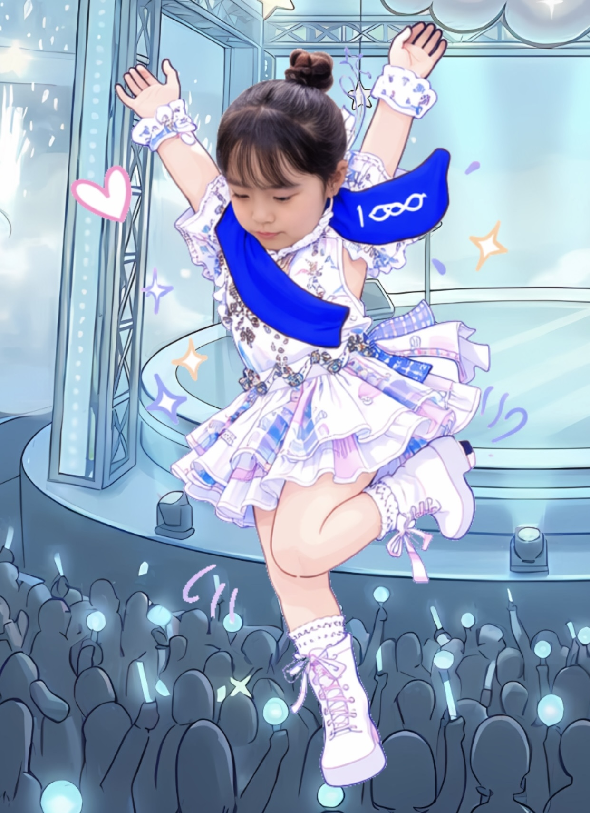
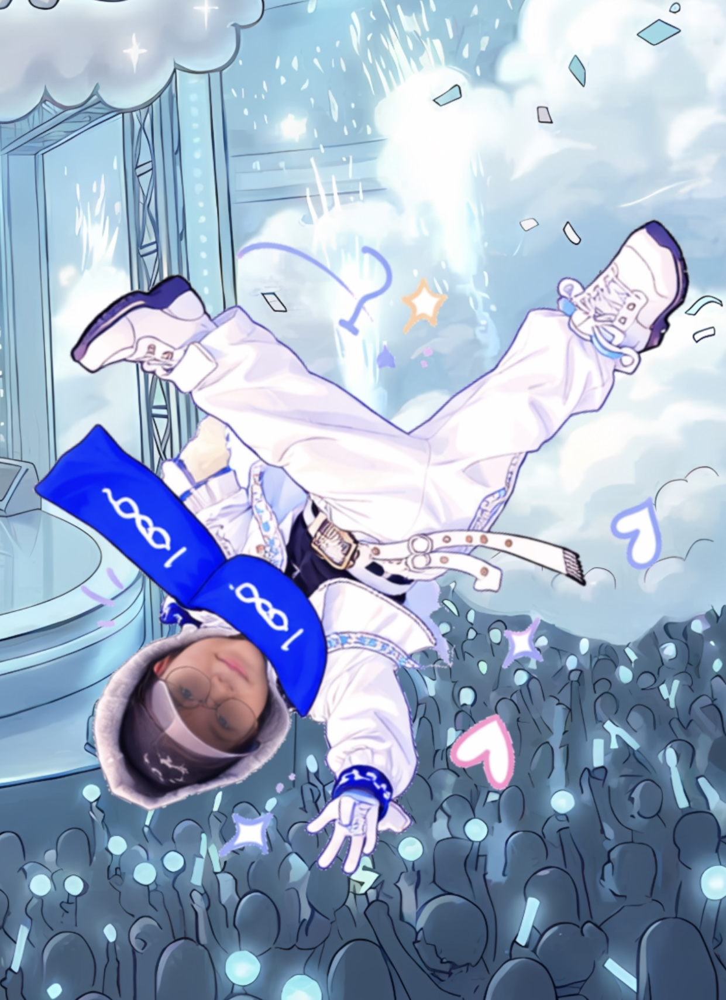

# tut02
# ☁️ Welcome to Our Stage!
## 🎤 NCT dreams
---
### 👥 NCT Dreams Introduction
> 저희 NCT Dreams는 김소윤, 원유청, 이태현 3명의 멤버가 모여 구성된 팀으로서, 세 멤버의 이니셜 SoYoo **'N'**, Yoo **'C'** hung, **'T'** aeHyun 과
> 세 멤버의 공통된 MBTI인 **N**의 특징 1) 상상력 풍부 2) 미래지향적 사고 3) 오픈 마인드 을 결합하여 **NCT Dreams** 라고 짓게 되었습니다.
---
> [!NOTE]
>🎨**NCT Dreams의 성공 공식**

```
   상상 (공통)
 + 끈기 (소윤)
 + 긍정 (유청)
 + 실행력 (태현)
──────────────
 = 꿈을 현실로 만드는 팀
```

> [!IMPORTANT]
> 저희는 무한한 상상력으로 무궁무진한 꿈을 꾸며 그 꿈을 현실에서 펼칠 수 있는 실행력과 끈기가 있는 팀 **NCT dreams** 입니다.
> 코코네스쿨이라는 무대에서, 머릿속의 상상을 현실의 서비스로 구현하고, 어떤 장애물 앞에서도 꺾이지 않는 끈기와 실행력으로 그 꿈을 시장의 가치로 증명해 나갑니다.
---
## 🌟 멤버 소개

| 구분 |  |  |  |
| :---: | :---: | :---: | :---: |
| | **N** | **C** | **T** |
| **이름** | **김소윤** | **원유청** | **이태현** |
| **MBTI** | ENFJ | INTP | INTP |
| **생일** | 2003.07.01 | 2002.06.06 | 2002.07.02 |
| **혈액형** | B형 | O형 | B형 |
| **담당** | 센터 | 메인댄서 | 메인보컬 |
| **취미** | 빵 먹기, 러닝, 그림그리기 | 노래듣기, 게임, 웹툰보기 | 농구, 헬스, 커피 마시기 |
| **장점** | 긍정적인 성격으로 팀워크 극대화, 강력한 체력과 끈기 | 창의적인 아이디어 제공, 공감, 평화로운 팀 분위기 조성 | 아이디어를 생각하고, 끊임없이 도전하고, 맡은 일은 끝까지 해내는 실행력 |
| **🔗 Github** | [](https://github.com/odct) | [](https://github.com/FancyYc) | [](https://github.com/leten02) 


---
## 🌟 주요 기능 및 슬라이드별 특징

### 1. 인트로 및 캐릭터 등장 (Stage 0 ~ 3)

- **특징:** 화면을 클릭하거나 마이크를 켜고 박수를 치면 단계별로 캐릭터가 한 명씩 마법 무대 위에 등장합니다.
- **인터랙션:**
    - **클릭 / 박수 소리 감지:** 화면 아무 곳이나 클릭하거나, 우측 상단의 마이크 아이콘을 켜고 큰 소리(박수)를 내면 다음 단계로 넘어갑니다.
    - **캐릭터 호버(Hover):** 등장한 캐릭터 위에 마우스를 올리면 캐릭터가 강조되며, 각자의 '강점'을 나타내는 말풍선이 나타납니다.
    - **캐릭터 클릭:** 캐릭터를 클릭하면 각 캐릭터에 어울리는 이모지 파티클이 팡팡 터지는 효과가 발생합니다.
- **캐릭터 소개:**
    - **소윤 (So yooN):** 강점: 끈기 / "포기하지 않고 끝까지 밀어붙이는 추진력 🔥"
    - **유청 (Yu Chung):** 강점: 긍정 / "어떤 상황에서도 가능성을 믿는 에너지 ✨"
    - **태현 (Tae Hyun):** 강점: 실행력 / "상상을 실제 결과물로 전환하는 행동력 💡"

### 2. 무대 비행 연출

- **특징:** 세 명의 캐릭터가 모두 모인 후, 마우스 휠을 아래로 굴리면(스크롤) 무대 양탄자가 하늘로 날아오르는 연출이 시작됩니다.
- **해설:** MBTI 두번째가 모두 N인 우리가 모야 상상(Dream)을 하고 이 상상을 실현시키고자 이동합니다.
- **인터랙션:**
    - **스크롤 연동:** 마우스 휠을 굴리는 정도에 따라 무대 양탄자가 점차 작아지며 위로 솟구치고, 배경이 우주/하늘 느낌으로 전환됩니다.
    - **구름 효과:** 무대 양탄자가 날아오를 때 주변에 구름 이미지들이 스쳐 지나가며 속도감과 공간감을 더해줍니다.

### 3. 최종 목적지: 교실 (Story Phase 4)

- **특징:** 양탄자가 하늘 높이 날아오른 후, 화면이 전환되며 최종 목적지인 '코코네스쿨 교실' 씬이 나타납니다.
- **해설**: 사상을 실현시키고자 이동해서 날아온 장소는 코코네스쿨 교실이다. 이 교실에서 우리가 상상하고 해보고자 하는 꿈같은 일을 실현시키고자 함을 나타낸다.
- **인터랙션:**
    - **화이트 스크린 클릭:** 교실 중앙에 있는 화이트 스크린에 마우스를 올리면 클릭 가능한 상태임을 알려주는 효과가 나타납니다.
    - **프로젝트 이동:** 화이트 스크린을 클릭하면 화면이 부드럽게 확대되며 흐려지는 전환 애니메이션과 함께, 팀의 깃허브 프로젝트 페이지(GitHub Projects)로 이동합니다.

## 🛠 기술 스택

- **Frontend:** React (Vite), TypeScript
- **Styling:** Tailwind CSS
- **Animation:** Framer Motion
- **Icons:** Lucide React

## 🚀 실행 방법

```bash
# 1. 의존성 설치
npm install

# 2. 개발 서버 실행
npm run dev
```

