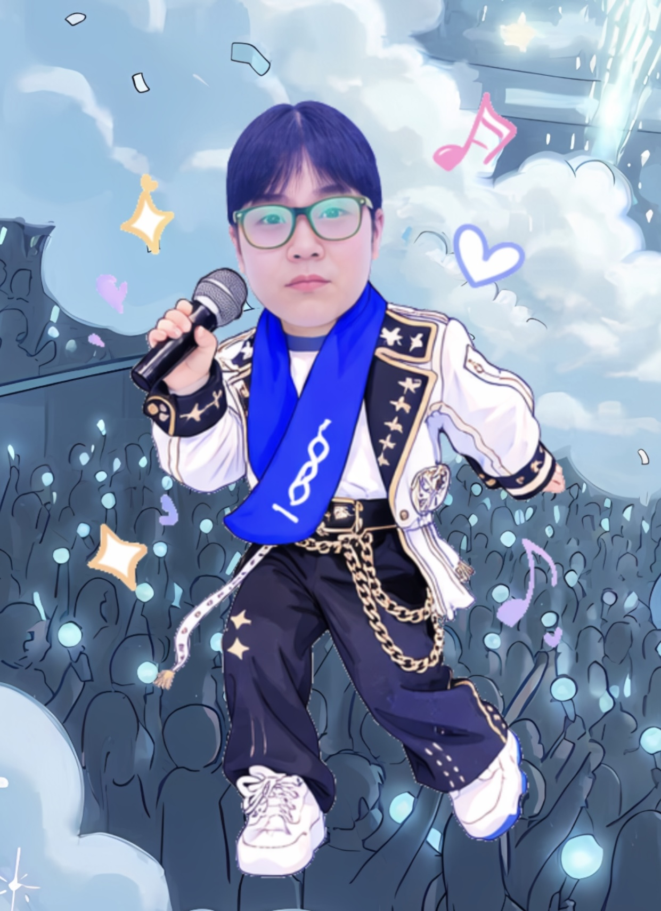

# tut02
# ☁️ Welcome to Our Stage!
## 🎤 NCT dreams
---
### 👥 NCT Dreams Introduction
> 저희 NCT Dreams는 김소윤, 원유청, 이태현 3명의 멤버가 모여 구성된 팀으로서, 세 멤버의 이니셜 SoYoo'N', Yoo'C'hung, 'T'aeHyun 과 세 멤버의 공통된 MBTI인 N의 특징 1) 상상력 풍부 2) 미래지향적 사고 3) 오픈 마인드 을 결합하여 NCT Dreams 라고 짓게 되었습니다.
---
> [!NOTE]
>🎨**NCT Dreams의 성공 공식**

```
   상상 (공통)
 + 끈기 (소윤)
 + 긍정 (유청)
 + 실행력 (태현)
──────────────
 = 꿈을 현실로 만드는 팀
```

> [!IMPORTANT]
> 저희는 무한한 상상력으로 무궁무진한 꿈을 꾸며 그 꿈을 현실에서 펼칠 수 있는 실행력과 끈기가 있는 팀 **NCT dreams** 입니다.
> 코코네스쿨이라는 무대에서, 머릿속의 상상을 현실의 서비스로 구현하고, 어떤 장애물 앞에서도 꺾이지 않는 끈기와 실행력으로 그 꿈을 시장의 가치로 증명해 나갑니다.
---
## 🌟 멤버 소개

| 구분 |  |  |  |
| :---: | :---: | :---: | :---: |
| | **N** | **C** | **T** |
| **이름** | **김소윤** | **원유청** | **이태현** |
| **MBTI** | ENFJ | INTP | INTP |
| **생일** | 2003.07.01 | 2002/06/06 | 2002.07.02 |
| **혈액형** | B형 | O형 | B형 |
| **담당** | 센터 | 메인댄서 | 메인보컬 |
| **취미** | 빵 먹기, 러닝, 그림그리기 | 노래듣기, 게임, 웹툰보기 | 농구, 헬스, 커피 마시기 |
| **장점** | 긍정적인 성격으로 팀워크 극대화, 강력한 체력과 끈기 | 창의적인 아이디어 제공, 공감, 평화로운 팀 분위기 조성 | 아이디어를 생각하고, 끊임없이 도전하고, 맡은 일은 끝까지 해내는 실행력 |
| **🔗 Github** | [](https://github.com/odct) | [](https://github.com/FancyYc) | [](https://github.com/leten02) 


---

